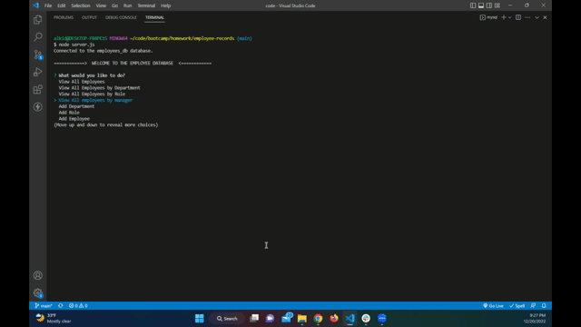

# Employee Records

  ## Table of Contents
  - [Description](#description)
  - [Installation](#installation)
  - [Usage](#usage)
  - [Questions](#Questions)
  

  ## Description
  🔍 This application is an interface (CMS) that allow non-developers to easily view and interact with information stored in a databases. User is able to manage a company's employee database using options: 
   1. "View All Departments"
   2. "View All Roles"
   3. "View All Employees"
   4. "View All Employees by Department"
   5. "View All Employees by Role"
   6. "View All employees by manager"
   7. "Add Department"
   8. "Add Role"
   9. "Add Employee"
   10. "Delete Department"
   11. "Delete Role"
   12. "Delete Employee"
   13. "Update Employee Role"
   14. "Update Employee Manager"
   15. "View total budget of departments"
                
  
  ## Installation
  💾 Run npm install in order to install the following npm package dependencies.
    

  
  ## Usage

  - View all department, role and employee 

   

  - View by department, role and manager 

   

  - Add department, role and employee 

  

  - Delete a department, role or employee  

   

  - Update role or manager/ View total budget of departments

   

  💻 Run node server.js to use the application.
    

  ## License 
  
    
     
  ## Questions
  ✋ Feel free to contact me for any questions: 
  
  ✉️ Email me with any questions: [alkida.vaci@gmail.com](alkida.vaci@gmail.com) 
  :octocat: Find me on GitHub: [alkidavaci](https://github.com/alkidavaci)